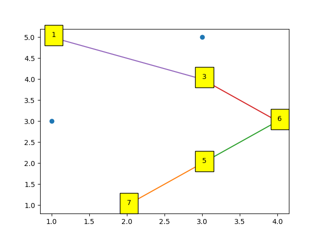
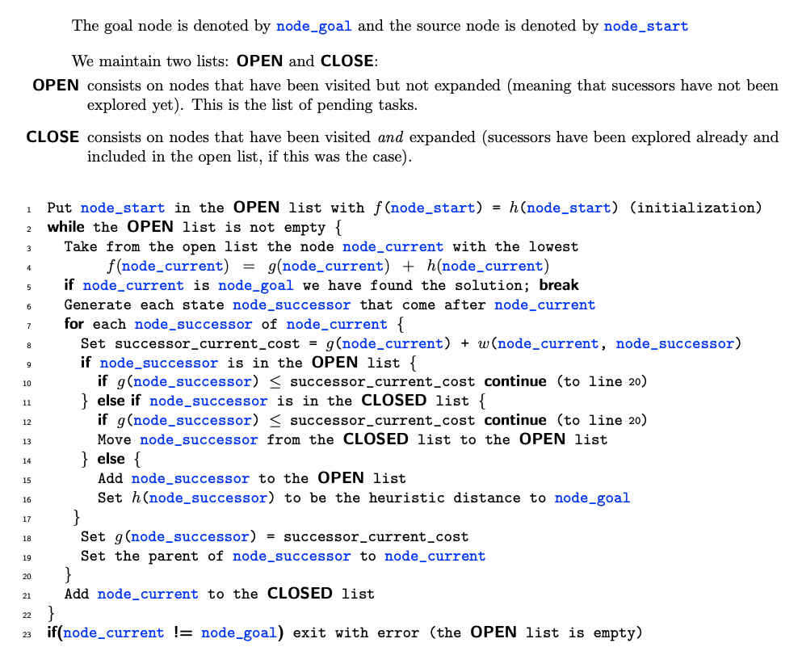

# Generic Implementation Of A* Algorithm

This is **short** and **simple** generic implementation of the [A* Algorithm](https://en.wikipedia.org/wiki/A*_search_algorithm).
You can redefine any part of the code for your own purposes.

## How To Use

### Nodes

Class `Node` is defined as follows:

```python
class Node:
    def __init__(self, ID, x, y, neighbours):
        self.ID = ID
        self.x = x
        self.y = y
        self.neighbours = neighbours
        self.parent = None
        self.g = 0
        self.h = 0

    def f(self):
        return self.g + self.h
```

Each node has to have:

- position (x and y)
- unique ID (`int`)
- list of it's neighbours' IDs (list of `int`s)

### Process

1. Import `Node` class and `a_star` function from `a_star.py` module.
```python
from a_star import Node, a_star
```
2. Create nodes and put all created nodes inside a list.
```python
nodes = [
        Node(ID=1, x=1, y=5, neighbours=[3]),
        Node(ID=2, x=3, y=5, neighbours=[3]),
        Node(ID=3, x=3, y=4, neighbours=[1, 2, 4, 6]),
        Node(ID=4, x=1, y=3, neighbours=[3, 5]),
        Node(ID=5, x=3, y=2, neighbours=[4, 6, 7]),
        Node(ID=6, x=4, y=3, neighbours=[3, 5]),
        Node(ID=7, x=2, y=1, neighbours=[5]),
    ]
```
3. Pick one node as a `start_node` and one node as `goal_node`.
```python
node_start = nodes[0]
node_goal = nodes[-1]
```
4. Then insert all of these inside an `a_star` function as follows:
```python
result = a_star(start=node_start, goal=node_goal, nodes=nodes)
```
The `result` will be *None* if there is no solution.
Otherwise, the `result` will contain the list of nodes
representing the path of a solution (from goal to start).

Example of a result plot:



## A* Algorithm

The pseudocode:



### Example Of Heuristic Function

```python
def heuristic(from_node, to_node):
    return np.sqrt((from_node.x - to_node.x) ** 2 + (from_node.y - to_node.y) ** 2)
```

### Example Of `w` Function

```python
def way(node_current, node_successor):
    return heuristic(node_current, node_successor)
```

## Credits

- [pseudocode](https://mat.uab.cat/~alseda/MasterOpt/AStar-Algorithm.pdf)
- [*zephirdeadline* implementation of A*](https://github.com/zephirdeadline/astar_python)

##

*Have fun!*

